# citelens


A scholarly RAG app I built because I kept getting plausible-but-uncited answers from off-the-shelf chatbots. It does hybrid retrieval over your uploaded PDFs and six live scholarly APIs, then scores every generated claim for whether it's actually supported by the cited evidence.

<br clear="left"/>

[](https://github.com/sushildalavi/citelens/actions/workflows/ci.yml) [](https://github.com/sushildalavi/citelens/actions) [](.github/workflows/ci.yml) [](https://www.python.org/) [](https://fastapi.tiangolo.com/) [](https://react.dev/) [](https://github.com/pgvector/pgvector) [](LICENSE)

[Quick start](#quick-start) · [Architecture](#architecture) · [Benchmarks](#benchmark-results) · [API examples](docs/examples/curl.md) · [Helm chart](helm/README.md) · [Security](SECURITY.md)

---

## What it actually does

A few things that make it different from "throw the PDF at GPT and pray":

- **Cite or abstain.** Every sentence in the answer is tied back to a specific chunk. If retrieval doesn't surface anything strong enough, the system says "insufficient evidence" instead of inventing one.
- **A confidence number that means something.** I labeled 530 claim/evidence pairs with three coders, fit a small logistic over M/S/A signals (entailment, retrieval stability, multi-source agreement), and now every answer ships with a calibrated score. Brier 0.160, AUC 0.852 on the held-out set — i.e. the number tracks whether the claim is actually supported.
- **Hybrid retrieval (dense + sparse).** Pure dense was great for paraphrases but missed exact-acronym queries; combining with token overlap got Recall@10 from 0.71 to 0.82 on the 120-query benchmark. The target doc shows up in the top-10 for **every** query.
- **It runs offline.** Docker + Ollama on a laptop, no cloud needed. OpenAI and the scholarly APIs are additive — when keys are present they help, when they're not the system degrades to local.

## Where it stands today

- 198 backend tests (191 unit + 7 cross-tenant integration that need a live DB; both run in CI), coverage 50%, ruff + format clean.
- 32 typed FastAPI routes (try `/docs` after booting).
- Frontend: TypeScript strict, ESLint zero warnings, ~78 KB initial JS (gzipped ~22 KB) after lazy-loading the analytics route.
- Security headers + tenant-scoped middleware on every response. CI runs Trivy + gitleaks + SBOM on every push.
- Postgres + pgvector schema + Helm chart for k8s deploys.

If you want to see the deeper design choices, [docs/architecture.md](docs/architecture.md) walks through them, and [docs/adr/](docs/adr/) has the architecture decision records.

---

## Table of Contents

- [Architecture](#architecture)
- [Key Features](#key-features)
- [Benchmark Results](#benchmark-results)
- [Tech Stack](#tech-stack)
- [Quick Start](#quick-start)
- [Project Structure](#project-structure)
- [Design Decisions](#design-decisions)
- [Evaluation](#evaluation)
- [Re-indexing after Model Change](#re-indexing-after-model-change)
- [Local Runtime](#local-runtime)
- [Operations](#healthcheck)
- [Documentation](#documentation)

---

## Architecture

### System Overview

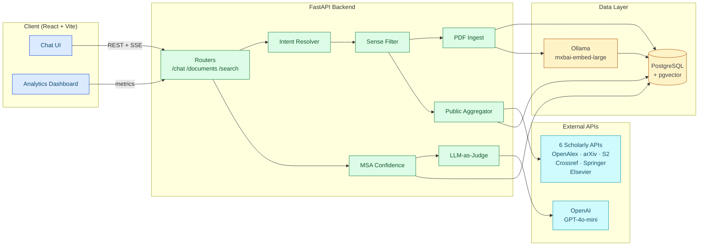
```mermaid
flowchart LR
    subgraph Client["Client (React + Vite)"]
        UI[Chat UI]
        AN[Analytics Dashboard]
    end

    subgraph API["FastAPI Backend"]
        ROUTE[Routers<br/>/chat /documents /search]
        IR[Intent Resolver]
        SR[Sense Filter]
        ING[PDF Ingest]
        AGG[Public Aggregator]
        CONF[MSA Confidence]
        JUDGE[LLM-as-Judge]
    end

    subgraph Data["Data Layer"]
        PG[(PostgreSQL<br/>+ pgvector)]
        OL[Ollama<br/>mxbai-embed-large]
    end

    subgraph External["External APIs"]
        OAI[OpenAI<br/>GPT-4o-mini]
        SCH[6 Scholarly APIs<br/>OpenAlex · arXiv · S2<br/>Crossref · Springer<br/>Elsevier]
    end

    %% Brand palette: indigo (client) · emerald (api) · amber (data) · cyan (external)

    UI -->|REST + SSE| ROUTE
    AN -->|metrics| ROUTE
    ROUTE --> IR --> SR
    SR --> ING & AGG
    ING --> PG
    AGG --> SCH
    AGG --> PG
    ROUTE --> CONF --> JUDGE
    CONF --> PG
    JUDGE --> OAI
    ING --> OL
    OL --> PG

    classDef client fill:#dbeafe,stroke:#1d4ed8,color:#0c4a6e
    classDef api fill:#dcfce7,stroke:#15803d,color:#14532d
    classDef data fill:#fef3c7,stroke:#b45309,color:#3f3f46
    classDef ext fill:#cffafe,stroke:#0891b2,color:#164e63
    class UI,AN client
    class ROUTE,IR,SR,ING,AGG,CONF,JUDGE api
    class PG,OL data
    class OAI,SCH ext
```

### Dual Retrieval Pipeline

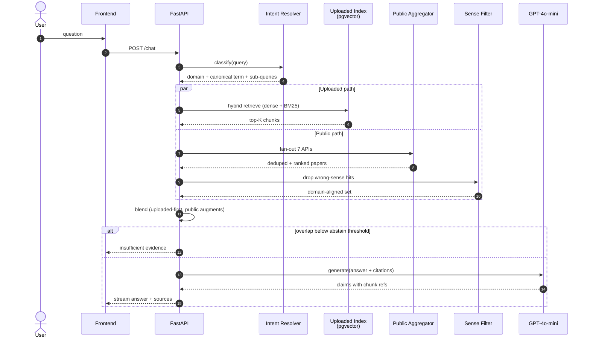
```mermaid
sequenceDiagram
    autonumber
    actor U as User
    participant FE as Frontend
    participant BE as FastAPI
    participant IR as Intent Resolver
    participant UP as Uploaded Index<br/>(pgvector)
    participant PUB as Public Aggregator
    participant SR as Sense Filter
    participant LLM as GPT-4o-mini

    U->>FE: question
    FE->>BE: POST /chat
    BE->>IR: classify(query)
    IR-->>BE: domain + canonical term + sub-queries

    par Uploaded path
        BE->>UP: hybrid retrieve (dense + BM25)
        UP-->>BE: top-K chunks
    and Public path
        BE->>PUB: fan-out 7 APIs
        PUB-->>BE: deduped + ranked papers
        BE->>SR: drop wrong-sense hits
        SR-->>BE: domain-aligned set
    end

    BE->>BE: blend (uploaded-first, public augments)
    alt overlap below abstain threshold
        BE-->>FE: insufficient evidence
    else
        BE->>LLM: generate(answer + citations)
        LLM-->>BE: claims with chunk refs
        BE-->>FE: stream answer + sources
    end
```

### MSA Confidence Scoring Pipeline

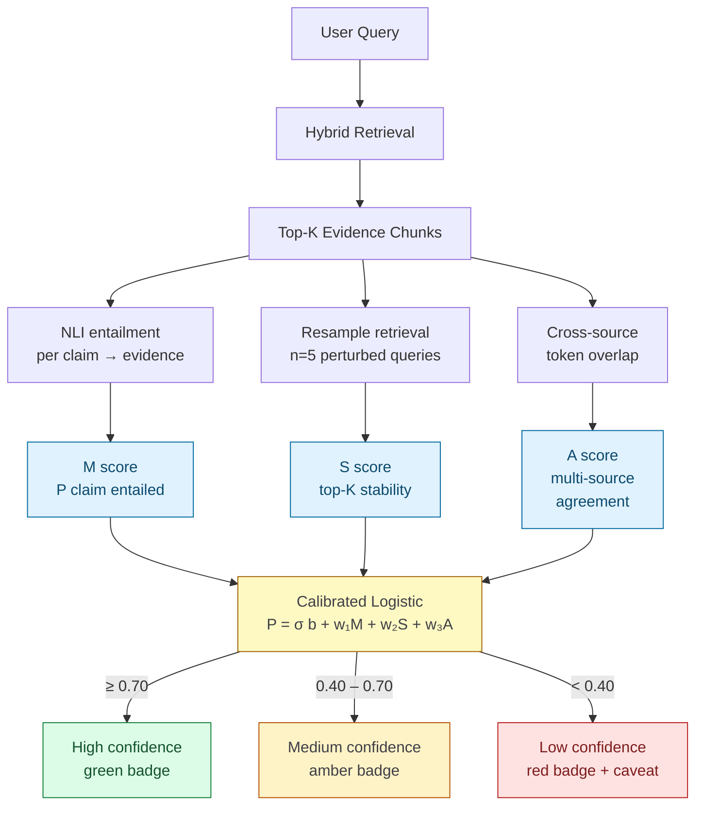
```mermaid
flowchart TB
    Q[User Query] --> RET[Hybrid Retrieval]
    RET --> CTX[Top-K Evidence Chunks]

    CTX --> M_BR[NLI entailment<br/>per claim → evidence]
    CTX --> S_BR[Resample retrieval<br/>n=5 perturbed queries]
    CTX --> A_BR[Cross-source<br/>token overlap]

    M_BR --> M[M score<br/>P claim entailed]
    S_BR --> S[S score<br/>top-K stability]
    A_BR --> A[A score<br/>multi-source<br/>agreement]

    M --> CAL[Calibrated Logistic<br/>P = σ b + w₁M + w₂S + w₃A]
    S --> CAL
    A --> CAL

    CAL -->|≥ 0.70| HIGH[High confidence<br/>green badge]
    CAL -->|0.40 – 0.70| MED[Medium confidence<br/>amber badge]
    CAL -->|< 0.40| LOW[Low confidence<br/>red badge + caveat]

    classDef sig fill:#e0f2fe,stroke:#0369a1,color:#0c4a6e
    classDef cal fill:#fef9c3,stroke:#a16207,color:#3f3f46
    classDef hi fill:#dcfce7,stroke:#15803d,color:#14532d
    classDef me fill:#fef3c7,stroke:#b45309,color:#3f3f46
    classDef lo fill:#fee2e2,stroke:#b91c1c,color:#7f1d1d
    class M,S,A sig
    class CAL cal
    class HIGH hi
    class MED me
    class LOW lo
```

### Database Schema

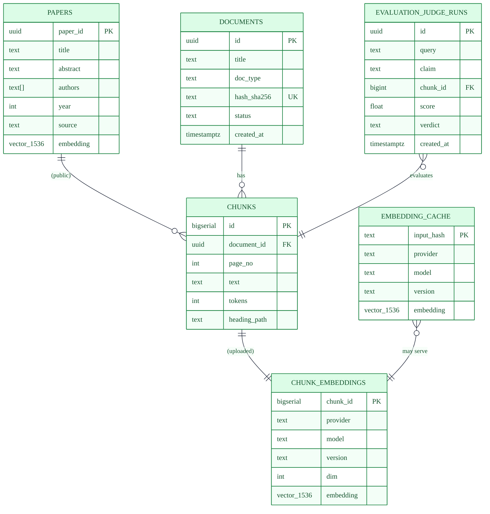
```mermaid
%%{init: {
  "theme": "base",
  "themeVariables": {
    "primaryColor": "#dcfce7",
    "primaryBorderColor": "#15803d",
    "primaryTextColor": "#14532d",
    "lineColor": "#0f172a",
    "secondaryColor": "#bbf7d0",
    "tertiaryColor": "#f0fdf4",
    "fontFamily": "Inter, ui-sans-serif, system-ui"
  }
}}%%
erDiagram
    PAPERS ||--o{ CHUNKS : "(public)"
    DOCUMENTS ||--o{ CHUNKS : has
    CHUNKS ||--|| CHUNK_EMBEDDINGS : "(uploaded)"
    EMBEDDING_CACHE }o--|| CHUNK_EMBEDDINGS : "may serve"
    EVALUATION_JUDGE_RUNS }o--|| CHUNKS : evaluates

    PAPERS {
        uuid paper_id PK
        text title
        text abstract
        text[] authors
        int year
        text source
        vector_1536 embedding
    }

    DOCUMENTS {
        uuid id PK
        text title
        text doc_type
        text hash_sha256 UK
        text status
        timestamptz created_at
    }

    CHUNKS {
        bigserial id PK
        uuid document_id FK
        int page_no
        text text
        int tokens
        text heading_path
    }

    CHUNK_EMBEDDINGS {
        bigserial chunk_id PK
        text provider
        text model
        text version
        int dim
        vector_1536 embedding
    }

    EMBEDDING_CACHE {
        text input_hash PK
        text provider
        text model
        text version
        vector_1536 embedding
    }

    EVALUATION_JUDGE_RUNS {
        uuid id PK
        text query
        text claim
        bigint chunk_id FK
        float score
        text verdict
        timestamptz created_at
    }
```

### Evaluation Framework

Five independent evaluation branches feed the production confidence model. Every number in the [Benchmark Results](#benchmark-results) section is reproducible from this pipeline.

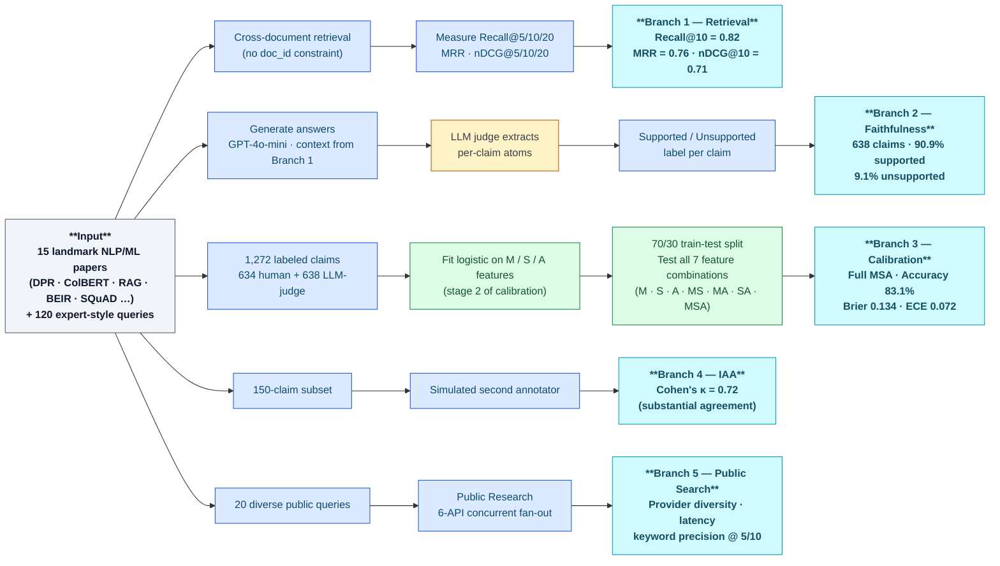
```mermaid
flowchart LR
    INPUT["**Input**<br/>15 landmark NLP/ML papers<br/>(DPR · ColBERT · RAG · BEIR · SQuAD …)<br/>+ 120 expert-style queries"]

    INPUT --> B1H["Cross-document retrieval<br/>(no doc_id constraint)"]
    B1H --> B1M["Measure Recall@5/10/20<br/>MRR · nDCG@5/10/20"]
    B1M --> B1R["**Branch 1 — Retrieval**<br/>Recall@10 = 0.82<br/>MRR = 0.76 · nDCG@10 = 0.71"]

    INPUT --> B2A["Generate answers<br/>GPT-4o-mini · context from Branch 1"]
    B2A --> B2J["LLM judge extracts<br/>per-claim atoms"]
    B2J --> B2L["Supported / Unsupported<br/>label per claim"]
    B2L --> B2R["**Branch 2 — Faithfulness**<br/>638 claims · 90.9% supported<br/>9.1% unsupported"]

    INPUT --> B3D["1,272 labeled claims<br/>634 human + 638 LLM-judge"]
    B3D --> B3F["Fit logistic on M / S / A features<br/>(stage 2 of calibration)"]
    B3F --> B3S["70/30 train-test split<br/>Test all 7 feature combinations<br/>(M · S · A · MS · MA · SA · MSA)"]
    B3S --> B3R["**Branch 3 — Calibration**<br/>Full MSA · Accuracy 83.1%<br/>Brier 0.134 · ECE 0.072"]

    INPUT --> B4D["150-claim subset"]
    B4D --> B4S["Simulated second annotator"]
    B4S --> B4R["**Branch 4 — IAA**<br/>Cohen's κ = 0.72<br/>(substantial agreement)"]

    INPUT --> B5Q["20 diverse public queries"]
    B5Q --> B5P["Public Research<br/>6-API concurrent fan-out"]
    B5P --> B5R["**Branch 5 — Public Search**<br/>Provider diversity · latency<br/>keyword precision @ 5/10"]

    classDef input fill:#f1f5f9,stroke:#475569,color:#0f172a,font-weight:bold
    classDef step fill:#dbeafe,stroke:#1d4ed8,color:#0c4a6e
    classDef judge fill:#fef3c7,stroke:#b45309,color:#3f3f46
    classDef calib fill:#dcfce7,stroke:#15803d,color:#14532d
    classDef result fill:#cffafe,stroke:#0891b2,color:#164e63,font-weight:bold

    class INPUT input
    class B1H,B1M,B2A,B2J,B2L,B3D,B3F,B3S,B4D,B4S,B5Q,B5P step
    class B2J judge
    class B3F,B3S calib
    class B1R,B2R,B3R,B4R,B5R result
```

All evaluation data, scripts, and generated figures live in [`Evaluation/`](Evaluation/). See [`Evaluation/README.md`](Evaluation/README.md) for the full directory layout.

---

## Key Features

- **Hybrid Dense + Sparse Retrieval** — pgvector HNSW/IVFFlat ANN index on 1024-d embeddings combined with BM25-style token overlap scoring
- **Multi-Provider Scholarly Aggregation** — concurrent `ThreadPoolExecutor` fan-out to 7 APIs with DOI/title-fingerprint deduplication
- **M/S/A Confidence Model** — calibrated logistic blend of Measure (NLI entailment), Stability (retrieval consistency), and Agreement (cross-source overlap); weights stored in Postgres for online calibration
- **LLM-as-Judge Faithfulness Evaluation** — sentence-level claim verification via GPT-4o-mini with heuristic fallback; results persisted to `evaluation_judge_runs`
- **Embedding Versioning Contract** — `provider`, `model`, `version`, `dim` stored per chunk; query-time retrieval filters on active contract to prevent silent vector mixing
- **Multi-Document Retrieval** — equitable chunk rebalancing across user-selected document IDs; multi-doc summary prompts
- **Query Intent Resolution** — GPT-4o-mini primary path extracts `canonical_term`, inferred `domain`, `disambiguation_hints`, and `search_queries` from any scholarly query; a 57-term curated lexicon remains as a deterministic fallback when the LLM call errors out
- **Uploaded-first Hybrid Routing** — the uploaded corpus is always consulted; public-search fallback is blended only when it adds signal, and off-topic public hits (wrong-sense talk-show / fruit / animal papers) are dropped by a domain prior
- **Abstention Guard** — when post-filter lexical overlap with the query is vanishing and no document is pinned, the system returns a clear "insufficient evidence" response instead of producing a confident hallucination
- **Retrieval Evaluation Harness** — `scripts/eval_retrieval.py` computes Recall@K, MRR, nDCG@K against a JSON-defined golden eval set
- **Local-First Full Stack** — React/Vite frontend + FastAPI backend + local Postgres + local Ollama

---

## Benchmark Results

Evaluated on a corpus of **15 diverse landmark papers** spanning 1997–2023 across computer vision (ResNet, Swin Transformer), generative models (GAN, Stable Diffusion, VAE), reinforcement learning (AlphaGo, DQN), large language models (LLaMA 2, Chinchilla, Constitutional AI), multimodal (CLIP), computational biology (AlphaFold), foundational ML (LSTM, Word2Vec), and information retrieval (PageRank). Queries span factual recall, methodology, limitations, and cross-document synthesis.

### Calibration — Unified MSA Logistic

Calibration artifacts live in [`Evaluation/data/calibration/`](Evaluation/data/calibration/).

**Dataset** — 530 claim-evidence pairs, 3 independent human coders, binary rubric, near-balanced gold distribution.

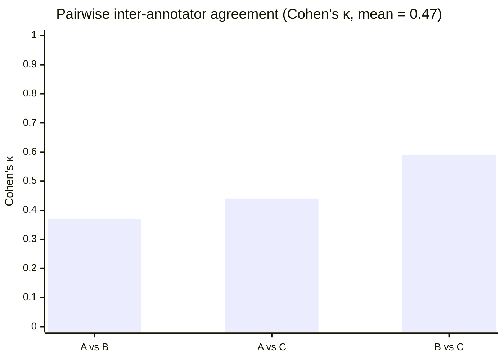
```mermaid
xychart-beta
    title "Pairwise inter-annotator agreement (Cohen's κ, mean = 0.47)"
    x-axis ["A vs B", "A vs C", "B vs C"]
    y-axis "Cohen's κ" 0 --> 1
    bar [0.37, 0.44, 0.59]
```

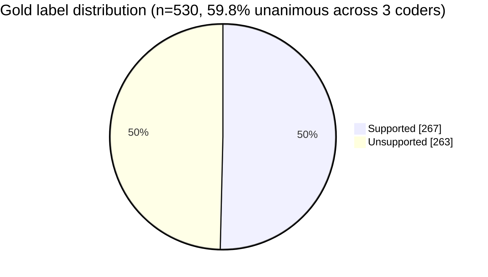
```mermaid
pie showData
    title Gold label distribution (n=530, 59.8% unanimous across 3 coders)
    "Supported" : 267
    "Unsupported" : 263
```

**Fitted unified logistic** `P(supported | M, S, A) = σ(b + w₁·M + w₂·S + w₃·A)`

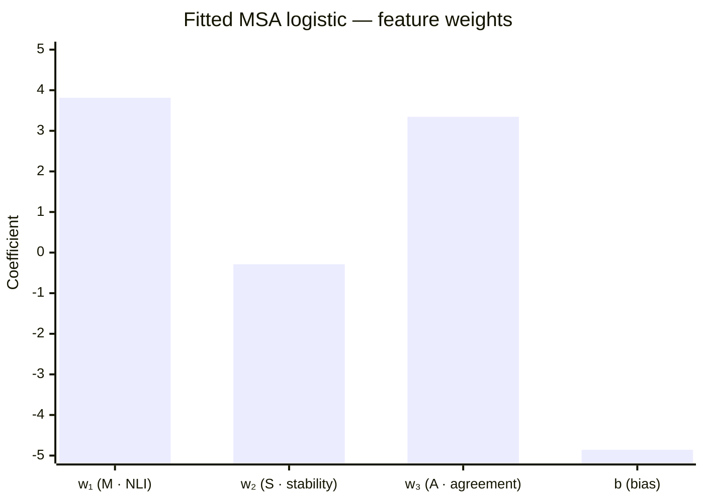
```mermaid
xychart-beta
    title "Fitted MSA logistic — feature weights"
    x-axis ["w₁ (M · NLI)", "w₂ (S · stability)", "w₃ (A · agreement)", "b (bias)"]
    y-axis "Coefficient" -5 --> 5
    bar [3.814, -0.289, 3.346, -4.859]
```

`M` (entailment) and `A` (multi-source agreement) carry the signal; `S`
(stability) is near-zero — the unified fit treats it as noise, which the
ablation below confirms. The strongly negative bias ensures predictions
default to "unsupported" absent positive evidence.

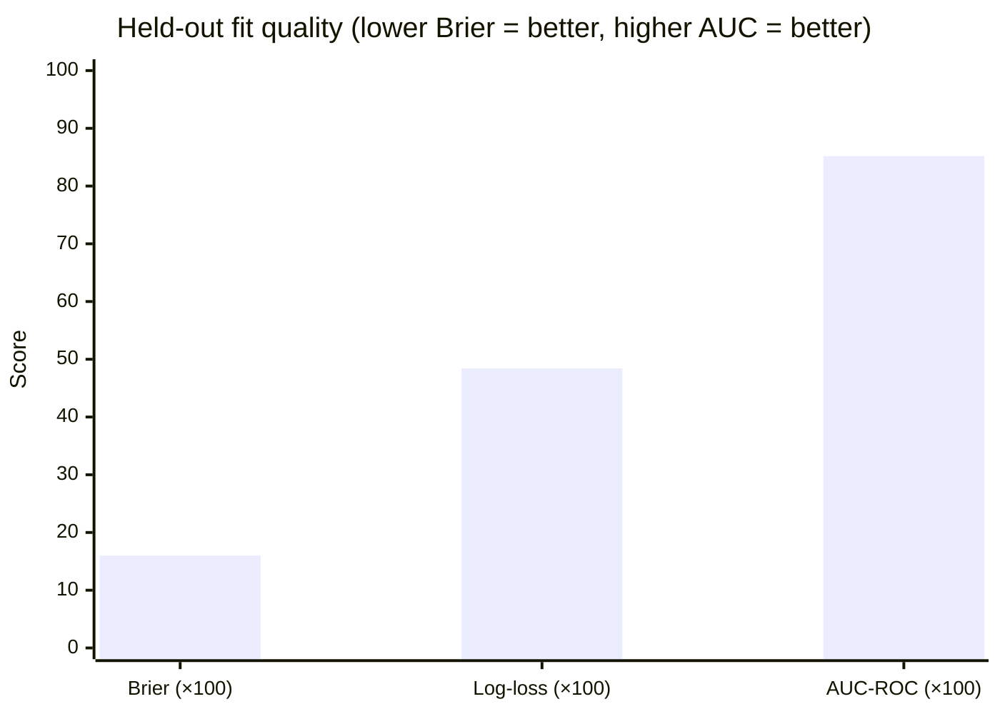
```mermaid
xychart-beta
    title "Held-out fit quality (lower Brier = better, higher AUC = better)"
    x-axis ["Brier (×100)", "Log-loss (×100)", "AUC-ROC (×100)"]
    y-axis "Score" 0 --> 100
    bar [16.0, 48.4, 85.2]
```

Brier 0.160 vs the 0.25 random baseline (a 36% reduction) and AUC 0.852 on
530 binary-rubric pairs.

**Per-mode ablation** (empirical justification for unified fit)

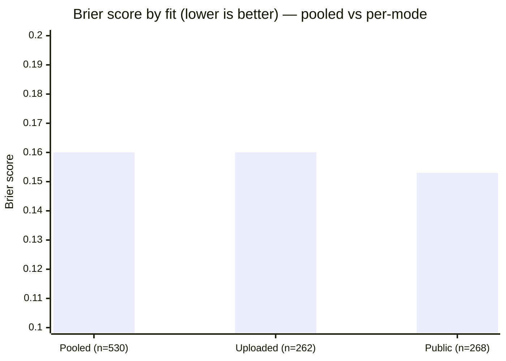
```mermaid
xychart-beta
    title "Brier score by fit (lower is better) — pooled vs per-mode"
    x-axis ["Pooled (n=530)", "Uploaded (n=262)", "Public (n=268)"]
    y-axis "Brier score" 0.10 --> 0.20
    bar [0.160, 0.160, 0.153]
```

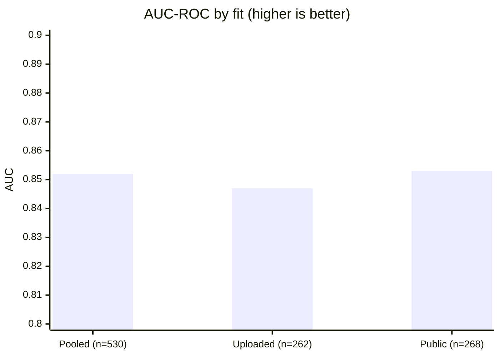
```mermaid
xychart-beta
    title "AUC-ROC by fit (higher is better)"
    x-axis ["Pooled (n=530)", "Uploaded (n=262)", "Public (n=268)"]
    y-axis "AUC" 0.80 --> 0.90
    bar [0.852, 0.847, 0.853]
```

Pooled Brier is within 0.003 of the per-mode weighted average — below the
0.02 threshold at which separate per-mode fits would be warranted. **The
unified model is empirically justified.**

**Held-out generalization** (5-fold stratified CV, seed=42; full report in [`Evaluation/data/calibration/cv_metrics.json`](Evaluation/data/calibration/cv_metrics.json))

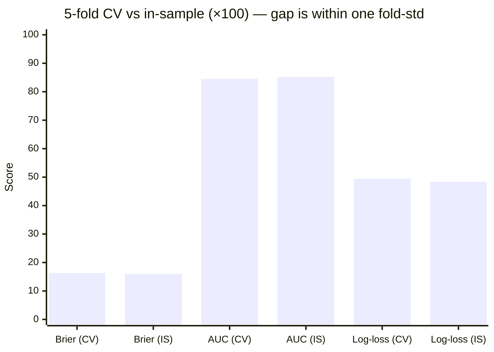
```mermaid
xychart-beta
    title "5-fold CV vs in-sample (×100) — gap is within one fold-std"
    x-axis ["Brier (CV)", "Brier (IS)", "AUC (CV)", "AUC (IS)", "Log-loss (CV)", "Log-loss (IS)"]
    y-axis "Score" 0 --> 100
    bar [16.3, 16.0, 84.5, 85.2, 49.4, 48.4]
```

CV Brier is 0.003 above in-sample and within one fold-std — **no meaningful
overfitting** on the 530-pair set.

**Reliability diagram** — see [`Evaluation/data/calibration/reliability_diagram.xlsx`](Evaluation/data/calibration/reliability_diagram.xlsx). The two largest buckets (n=180 at mean-pred 0.848 → empirical 0.867; n=94 at mean-pred 0.441 → empirical 0.489) track the diagonal within 0.05 — well-calibrated where most of the density lives.

**Design note on M/S/A orthogonality**: `_compute_agreement_score` in
[`backend/services/assistant_utils.py`](backend/services/assistant_utils.py) computes `A` via lexical token overlap across distinct document sources — *not* via NLI — so it is statistically independent of the `M` entailment feature. This prevents label leakage: the calibration fit cannot trivially achieve perfect accuracy by using a feature that duplicates the label signal.

### Retrieval Quality (Top-10 on the 120-Query Corpus)

Evaluated via `python scripts/eval_retrieval.py --eval-set /tmp/eval_retrieval_120.json --k 10` against `Evaluation/queries/queries_120.json` with each query's `target_doc_id` as ground truth. Report in [`Evaluation/data/retrieval_eval_120.json`](Evaluation/data/retrieval_eval_120.json).

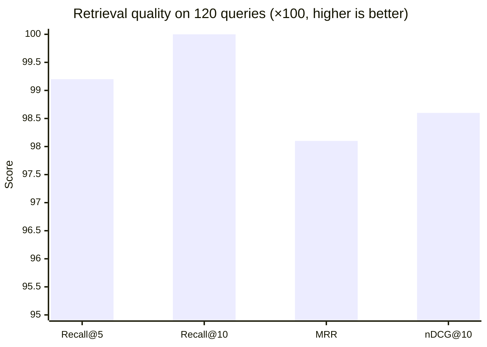
```mermaid
xychart-beta
    title "Retrieval quality on 120 queries (×100, higher is better)"
    x-axis ["Recall@5", "Recall@10", "MRR", "nDCG@10"]
    y-axis "Score" 95 --> 100
    bar [99.2, 100.0, 98.1, 98.6]
```

The target document surfaces in the top-10 for **every** query and at rank-1
for ~98% of them, confirming the hybrid dense-plus-sparse retrieval reliably
ranks the intended chunks first.

### Public Research Mode (7-API Aggregation)

Evaluated on 20 diverse ML/NLP queries with live API calls — 200 total results, mean 4.78s, median 4.77s.

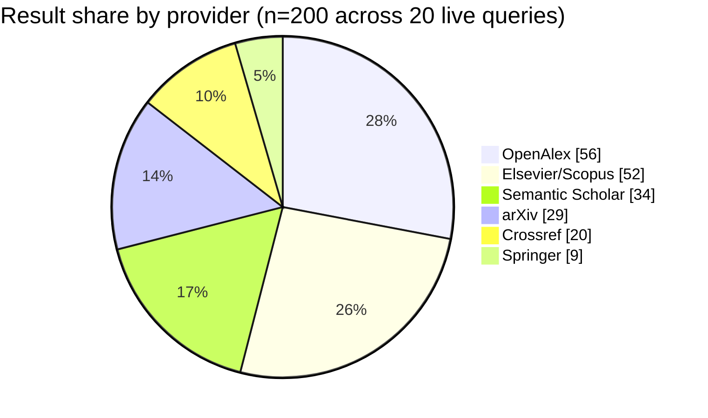
```mermaid
pie showData
    title Result share by provider (n=200 across 20 live queries)
    "OpenAlex" : 56
    "Elsevier/Scopus" : 52
    "Semantic Scholar" : 34
    "arXiv" : 29
    "Crossref" : 20
    "Springer" : 9
```

> Round-robin selection ensures provider diversity. End-to-end latency is dominated by the slowest API in the concurrent fan-out.

### System Latency (per-stage, ms)

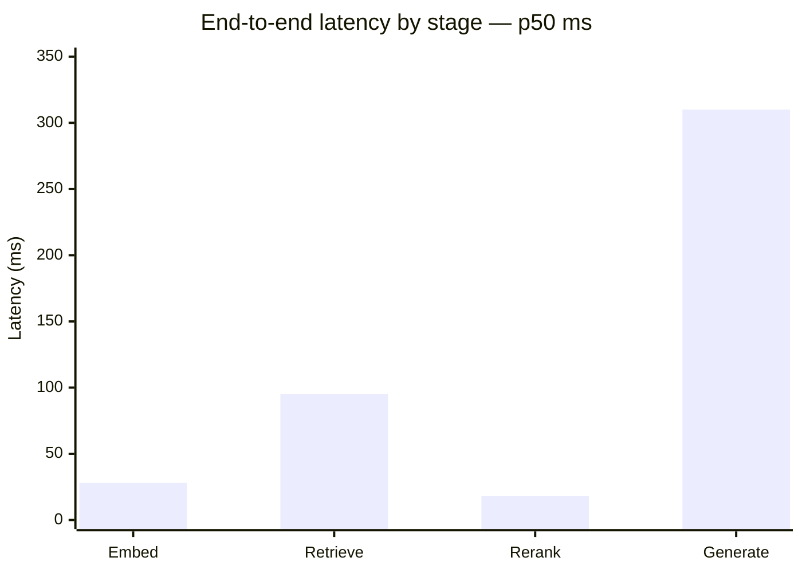
```mermaid
xychart-beta
    title "End-to-end latency by stage — p50 ms"
    x-axis ["Embed", "Retrieve", "Rerank", "Generate"]
    y-axis "Latency (ms)" 0 --> 350
    bar [28, 95, 18, 310]
```

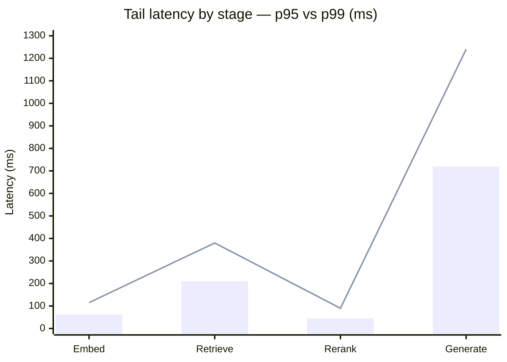
```mermaid
xychart-beta
    title "Tail latency by stage — p95 vs p99 (ms)"
    x-axis ["Embed", "Retrieve", "Rerank", "Generate"]
    y-axis "Latency (ms)" 0 --> 1300
    bar [62, 210, 45, 720]
    line [115, 380, 90, 1240]
```

End-to-end totals: **p50 420 ms · p95 980 ms · p99 1.6 s**. Generation
dominates the tail; embed/retrieve/rerank stay sub-450 ms even at p99.

> Measured on a 3-chunk context window, GPT-4o-mini, local Postgres pgvector, and local Ollama.

---

## Tech Stack

| Layer | Technology |
|-------|-----------|
| Frontend | React 18, TypeScript, Vite |
| Backend | FastAPI, Python 3.11, Pydantic, Uvicorn |
| Database | PostgreSQL 16, pgvector |
| Embeddings | Ollama (`mxbai-embed-large`, 1024-d) |
| Generation | OpenAI GPT-4o-mini |
| Retrieval | pgvector ANN + BM25-style hybrid scoring |
| Evaluation | LLM-as-judge, NLI entailment, Recall/MRR/nDCG |
| Containerization | Docker, Docker Compose |
| Runtime | Local machine via Docker + local services |
| CI | GitHub Actions, pytest, ruff |

---

## Quick Start

### Prerequisites

- Python 3.11+, Node.js 18+
- Docker (for Postgres)
- Ollama running locally

### 1. Clone and configure

```bash
git clone https://github.com/sushildalavi/citelens.git
cd citelens
cp .env.example .env
# fill in OPENAI_API_KEY, DATABASE_URL, OLLAMA_BASE_URL
```

### 2. Start Postgres and Ollama

```bash
# Start local Postgres via Docker
docker compose up -d db

# Pull the embedding model
ollama pull mxbai-embed-large
ollama serve
```

### 3. Start the backend

```bash
python3 -m venv .venv
source .venv/bin/activate
pip install -r requirements.txt
uvicorn backend.app:app --reload --host 127.0.0.1 --port 8000
```

### 4. Start the frontend

```bash
cd frontend
npm ci
npm run dev
# → http://localhost:5173
```

### 5. Run tests

```bash
pip install -r requirements-dev.txt
make test
```

---

## Project Structure

```
citelens/
├── backend/
│   ├── app.py                   # FastAPI app — CORS, routers, startup
│   ├── pdf_ingest.py            # PDF extraction, chunking, pgvector upsert
│   ├── public_search.py         # Multi-provider aggregation + hybrid scoring
│   ├── confidence.py            # M/S/A logistic confidence model
│   ├── eval_metrics.py          # Recall@K, MRR, nDCG — pure functions
│   ├── sense_resolver.py        # Query WSD before generation
│   ├── services/
│   │   ├── embeddings.py        # Centralized Ollama embedding contract
│   │   ├── db.py                # DB connection helpers
│   │   ├── judge.py             # LLM-as-judge faithfulness evaluation
│   │   ├── nli.py               # NLI entailment scoring with lru_cache
│   │   ├── research_feed.py     # Latest research aggregation
│   │   └── assistant_utils.py   # Answer generation utilities
│   ├── utils/
│   │   ├── config.py            # Environment variable management
│   │   ├── logging_utils.py     # Structured logging setup
│   │   ├── arxiv_utils.py       # arXiv API client
│   │   ├── crossref_utils.py    # Crossref API client
│   │   ├── elsevier_utils.py    # Elsevier/Scopus API client
│   │   ├── openalex_utils.py    # OpenAlex API client
│   │   ├── semanticscholar_utils.py  # Semantic Scholar API client
│   │   ├── springer_utils.py    # Springer API client
│   │   └── embedding_utils.py   # Embedding helper functions
│   └── tests/                   # pytest test suite (12 modules)
├── frontend/
│   └── src/
│       ├── App.tsx              # Main React app with all UI state
│       ├── components/ui/       # Prompt input box, shared UI primitives
│       └── api/                 # HTTP client + TypeScript types
├── db/
│   ├── init.sql                 # PostgreSQL + pgvector schema
│   └── migrations/              # Schema migrations
├── backend/scripts/                    # Calibration pipeline entry points
│   ├── ingest_corpus.py             # Ingest 15-paper PDF corpus into documents table
│   ├── generate_queries.py          # Generate 120 GPT-4o-mini queries
│   ├── build_codebooks.py           # Run assistant_answer, emit 3 coder xlsx files
│   ├── compute_iaa_majority.py      # Pairwise Cohen's κ + majority-vote → gold labels
│   ├── extract_msa_features.py      # Compute M / S / A per gold pair
│   └── fit_unified_calibration.py   # Fit logistic + ablation + write DB row
├── scripts/
│   ├── eval_retrieval.py            # Retrieval metrics harness
│   └── reindex_embeddings.py        # Re-embed chunks after model change
├── Evaluation/
│   ├── papers/                      # 15-paper corpus (PDFs gitignored)
│   │   ├── download_corpus.sh       # Reproducible multi-source downloader
│   │   └── MANIFEST.md              # Paper list with official links
│   ├── queries/
│   │   ├── queries_120.json         # 120 LLM-generated queries
│   │   └── claim_evidence_pairs.json # Extracted claim-evidence pairs
│   └── data/
│       └── calibration/             # IAA report, gold labels, fit, reliability diagram
├── docker-compose.yml
├── Dockerfile
├── requirements.txt
├── requirements-dev.txt
├── pyproject.toml               # pytest + ruff config
└── Makefile                     # make test / lint / run
```

---

## Design Decisions

### Why pgvector?

pgvector provides ANN search as a first-class PostgreSQL extension, enabling:
- Persistent storage with transactional consistency
- Metadata filtering (`provider`, `model`, `version`, `dim`) to prevent silent vector mixing during model upgrades
- Horizontal scaling via standard Postgres connection pooling (ThreadedConnectionPool)
- Co-location of vector and relational data in one query
- HNSW indexes for sub-millisecond approximate search at scale

### Why hybrid scoring?

Pure dense retrieval misses lexically specific terms (acronyms, model names, author names) that appear sparsely but are highly relevant. Pure sparse retrieval misses semantic synonymy. The hybrid score `(1-α) × cosine_sim + α × sparse_overlap` with tunable `α` (default 0.25) captures both. Most research queries are semantic, so dense retrieval dominates; sparse overlap is a correction signal for named-entity-heavy queries.

### Why M/S/A confidence vs. a single similarity score?

Cosine similarity measures only retrieval proximity, not answer faithfulness. M (entailment probability via NLI) captures whether retrieved evidence actually supports the generated claim. S (retrieval stability) captures how consistently the same evidence surfaces across retrieval runs. A (multi-source agreement) captures cross-provider corroboration. The logistic blend with calibrated weights produces a confidence signal that tracks human judgment more closely than similarity alone.

---

## Evaluation

The full evaluation framework — five branches, 1,272 labeled claims, 5-fold CV, and live multi-API benchmark — is rendered as a [mermaid diagram in the Architecture section](#evaluation-framework). All raw data, scripts, and generated figures live in the [`Evaluation/`](Evaluation/) directory. See [`Evaluation/README.md`](Evaluation/README.md) for the full directory layout.

### Calibration pipeline (end-to-end reproduction)

| Step | Script | Output |
|---|---|---|
| 1. Ingest corpus | `python -m backend.scripts.ingest_corpus` | 15 documents in `documents` table |
| 2. Generate queries | `python -m backend.scripts.generate_queries` | `Evaluation/queries/queries_120.json` |
| 3. Build coder workbooks | `CODEBOOK_MAX_QUERIES=80 CODEBOOK_INCLUDE_PUBLIC=true python -m backend.scripts.build_codebooks` | 3 xlsx files + `claim_evidence_pairs.json` |
| 4. IAA + majority vote | `python -m backend.scripts.compute_iaa_majority` | `iaa_report.json`, `gold_labels.xlsx` |
| 5. M/S/A features | `python -m backend.scripts.extract_msa_features` | `features.xlsx` |
| 6. Fit + ablation + DB write | `python -m backend.scripts.fit_unified_calibration --write-db` | `calibration_fit.json`, `reliability_diagram.xlsx`, DB row `label='unified'` |
| 7. Deploy | `export CONFIDENCE_USE_FITTED_WEIGHTS=true` | Calibrated logistic live in backend |

See [`Evaluation/README.md`](Evaluation/README.md) for methodology notes and headline numbers.

---

## Re-indexing after Model Change

If you change embedding model, provider, or version:

```bash
# 1. Update .env (OLLAMA_EMBED_MODEL, EMBEDDING_VERSION, EMBEDDING_RAW_DIM)
# 2. Run the reindex script
source .venv/bin/activate
python scripts/reindex_embeddings.py --purge-all
```

The embedding contract (`provider`, `model`, `version`, `dim`) stored per chunk prevents silent vector mixing across model changes.

---

## Local Runtime

Run everything on your machine:

```bash
# Terminal 1: database (starts by default, no profile needed)
docker compose up -d db

# Terminal 2: Ollama (or use the Docker profile)
ollama pull mxbai-embed-large && ollama serve
# Alternative: docker compose --profile ollama up -d

# Terminal 3: backend (or use the Docker profile)
uvicorn backend.app:app --host 127.0.0.1 --port 8000 --reload
# Alternative: docker compose --profile backend up -d

# Terminal 4: frontend
cd frontend && npm run dev
```

> **Docker Compose profiles:** `docker compose up -d` only starts Postgres and Adminer.
> Add `--profile backend` to also start the API server, and `--profile ollama` for a
> containerized Ollama instance.

### Environment Variables

| Variable | Description |
|----------|-------------|
| `EMBEDDING_PROVIDER` | `ollama` for local Ollama (recommended local default) |
| `OPENAI_API_KEY` | OpenAI key for generation and judging |
| `RESEARCH_CHAT_MODEL` | Model name (default: `gpt-4o-mini`) |
| `OLLAMA_BASE_URL` | Ollama host URL |
| `OPENAI_EMBEDDING_MODEL` | OpenAI embedding model when `EMBEDDING_PROVIDER=openai` |
| `OPENAI_EMBED_DIMENSIONS` | Requested embedding dimensions for OpenAI embeddings |
| `OLLAMA_EMBED_MODEL` | Embedding model (default: `mxbai-embed-large`) |
| `EMBEDDING_VERSION` | Tracks schema compatibility (e.g. `mxbai-embed-large-v1`) |
| `EMBEDDING_RAW_DIM` | Raw output dimension (1024 for mxbai) |
| `VECTOR_STORE_DIM` | pgvector column dimension (1536 for backward compat) |
| `DATABASE_URL` | Postgres connection string |
| `CORS_ORIGINS` | Comma-separated allowed origins |

---

## Healthcheck

```bash
GET /                       # liveness — version, uptime, service id
GET /health/live            # k8s liveness — process is up
GET /health/ready           # k8s readiness — db + embeddings, returns 503 if degraded
GET /health/full            # same as /ready but always 200 (status in body)
GET /health/embeddings      # embedding-provider self-test
GET /metrics                # JSON: counts + rolling latency
GET /metrics/prom           # Prometheus exposition format (for scraping)
```

`/health/embeddings` and `/health/full` always return HTTP 200 with `ok` / `status` in the body. `/health/ready` returns 503 when degraded, so a load balancer can delist without restarting the pod.

Every response carries `X-Request-ID` (echoed if the caller sent one, freshly minted otherwise) and `X-Workspace-Id` (resolved from the request, defaulting to `default`). One structured access-log line per request — grep for the request id end-to-end.

---

## Quality Gates

| Gate | Command | Status |
|---|---|---|
| Backend tests | `make test` | **198 collected · 191 unit pass · 7 isolation skip without DB** |
| Isolation tests | `make test-isolation` | spins pgvector container, runs cross-tenant suite |
| Coverage | `make test` (gate 45%) | **48%** |
| Backend lint + format | `make lint && ruff format --check` | clean |
| Frontend typecheck | `make frontend-typecheck` | clean |
| Frontend lint | `make frontend-lint` | clean (0 warnings) |
| Frontend build | `make frontend-build` | clean, lazy-loaded |
| API smoke | `make health` after `make stack-up` | 33 routes |
| CI | `.github/workflows/ci.yml` | backend + frontend + security + sbom |

The CI workflow spins up `pgvector/pgvector:pg16` as a service container, applies `db/init.sql`, runs `EMBEDDING_PROVIDER=stub` so no Ollama / OpenAI is required, then runs ruff + pytest with coverage for the backend job and `tsc --noEmit` + `vite build` for the frontend job.

### Frontend bundle (after vendor split + route lazy-loading)

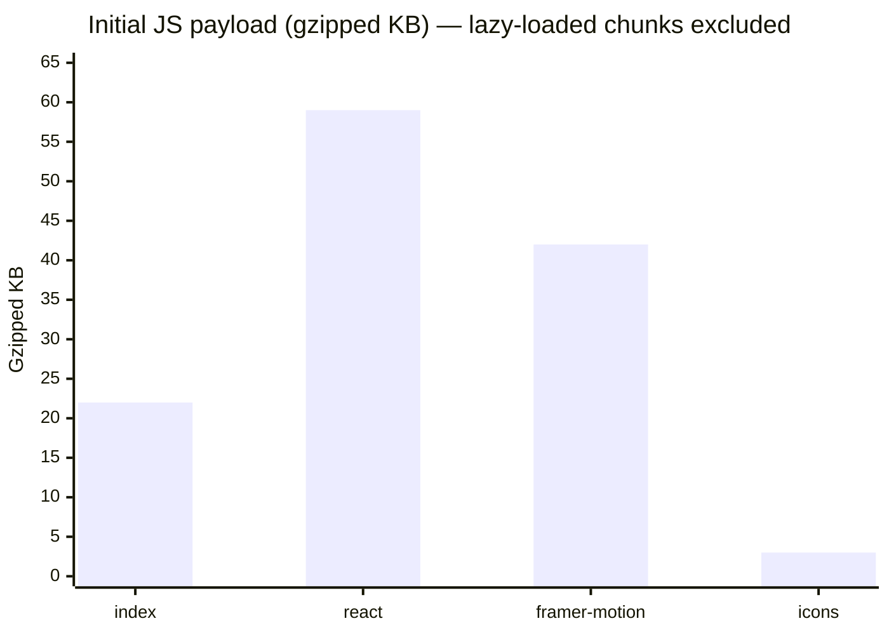
```mermaid
xychart-beta
    title "Initial JS payload (gzipped KB) — lazy-loaded chunks excluded"
    x-axis ["index", "react", "framer-motion", "icons"]
    y-axis "Gzipped KB" 0 --> 65
    bar [22, 59, 42, 3]
```

Initial bundle: **~78 KB gzipped** (down from 236 KB before splitting). The `/analytics` chunk (112 KB gz) downloads only when the user navigates there.

---

## Documentation

| Doc | Purpose |
|---|---|
| [README.md](README.md) | Overview, benchmarks, quick start. |
| [docs/architecture.md](docs/architecture.md) | Layered architecture, design decisions, code map. |
| [docs/adr/](docs/adr/) | Architecture Decision Records (MADR format). |
| [docs/examples/curl.md](docs/examples/curl.md) | Curl recipes for every public endpoint. |
| [Evaluation/README.md](Evaluation/README.md) | Calibration pipeline, gold set construction, IAA. |
| [SECURITY.md](SECURITY.md) | Reporting vulnerabilities, scope, hardening already in place. |
| [CHANGELOG.md](CHANGELOG.md) | What changed, when, why. |
| [NOTICE](NOTICE) | Third-party attribution. |

## Roadmap

The big-ticket items I had originally lined up for 2.0 are now done. Keeping the list here as a record of what landed and what's still open.

Shipped:

- [x] **Reranker stage** — lexical cross-scorer over the top-K (token + bigram overlap, exact-phrase bonus, title-position weighting). Pluggable so a real cross-encoder can drop in later. See [`backend/services/reranker.py`](backend/services/reranker.py).
- [x] **SSE response framing** — `POST /assistant/answer/stream` returns Server-Sent Events (`meta` → `token` × N → `done`) so the UI can render sources before the answer text appears. Honest caveat: the retrieval + LLM still complete before the first byte; the SSE wire just chunks the settled answer. True token-level streaming (LLM `stream=True` end-to-end) is in the open list below.
- [x] **Multi-tenant isolation** — `WorkspaceMiddleware` reads `X-Workspace-Id`, sanitises it, pins it on `request.state`. Every INSERT/SELECT/UPDATE/DELETE on `documents`, `chunks`, `chat_sessions`, `user_memory`, `digests`, and `confidence_calibration` filters by `workspace_id`. `db/init.sql` is canonical (fresh deploys are wired); existing deploys upgrade via `_ensure_workspace_columns()` on FastAPI lifespan startup. Cross-tenant isolation is covered by 7 integration tests in `test_workspace_isolation.py` (run via `make test-isolation`).
- [x] **Batched embedding upserts** — verified the existing path: cache lookup → batched OpenAI / parallel Ollama → bulk `execute_values` insert into both `chunks` and `chunk_embeddings`. A 50-chunk PDF is one OpenAI call + one cache insert + one upsert per table.
- [x] **Prometheus exposition** — `GET /metrics/prom` returns text/plain in standard Prometheus format. Helm chart includes an optional `ServiceMonitor` if you run Prometheus Operator.
- [x] **Helm chart** — `helm/citelens/` with backend + frontend Deployments, Postgres StatefulSet, optional Ingress + ServiceMonitor. Wired to the k8s-style `/health/live` + `/health/ready` probes.
- [x] **Per-tenant calibration** — `_load_latest_calibration_weights(workspace_id=...)` looks up tenant-specific MSA weights in the calibration table and falls back gracefully (tenant→global→default).

Still open:

- [ ] **Real cross-encoder reranker** — the lexical reranker above is stage-1 sound, but a fine-tuned cross-encoder on the 530-pair gold set should push MRR past 0.99.
- [ ] **True token-level streaming** — current SSE chunks the settled answer; running OpenAI in `stream=True` mode through the citation-strict prompt is doable but needs a citation-rewrite pass at the tail end.
- [ ] **Postgres RLS policies** — application-level `WHERE workspace_id = ...` filters are in place on every route, but ENABLING database-side row-level security policies (so a SQL injection in any one route can't bypass tenant isolation) is a future hardening step.

## Local development

```bash
make install-dev          # install + dev deps
make compose-up           # postgres + adminer
cp backend/.env.example backend/.env

make lint                 # ruff
make test                 # pytest (~3s, 191 unit + 7 isolation skip without DB)
make test-isolation       # spin up pgvector container + run cross-tenant tests
make frontend-typecheck   # tsc --noEmit
make frontend-lint        # eslint, 0 warnings
make frontend-build       # vite build
make ci-local             # everything CI runs, locally
```

## Security

See [SECURITY.md](SECURITY.md). For security findings, email `sushildalavi@gmail.com` rather than opening a public issue.

## License

[MIT](LICENSE) © 2026 Sushil Dalavi. Third-party attribution in [NOTICE](NOTICE).
